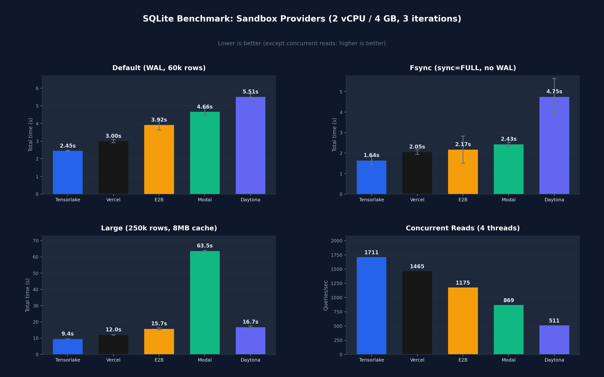

# Sandbox File System I/O Benchmarks

Benchmarks SQLite performance across five sandbox providers: **Tensorlake**, **Vercel**, **Daytona**, **E2B**, and **Modal**.

All sandboxes were configured with **2 vCPUs and ~4 GB RAM**. Each benchmark was run **3 times**, reporting mean +/- standard deviation.



## What It Benchmarks

The benchmark script (`benchmark.py`) runs 11 SQLite operations with deterministic data (`random.seed(42)`) across three modes:

| Mode | Description |
|---|---|
| **Default** | WAL mode, synchronous=NORMAL, 64MB cache, 60k rows (8.68 MB) |
| **Fsync** | synchronous=FULL, DELETE journal mode, 25k rows (4.05 MB) |
| **Large** | WAL mode, synchronous=NORMAL, 8MB cache, 250k rows (34.85 MB) |

| Operation | Description |
|---|---|
| Sequential inserts | Single-row INSERTs in autocommit |
| Batch inserts | `executemany` INSERT |
| SELECT COUNT(*) | Full table count |
| Range queries | `WHERE value BETWEEN ? AND ?` with index |
| LIKE queries | `WHERE name LIKE ?` (full scan) |
| Updates | Single-row UPDATEs by name |
| Deletes | Single-row DELETEs by name |
| Transaction inserts | INSERTs within explicit BEGIN/COMMIT |
| Aggregates | AVG, MIN, MAX, SUM + GROUP BY |
| Join query | Two-table JOIN with WHERE filter |
| Concurrent reads | 4 threads x 500 range queries each (tests multi-core) |

## Results

### Default Mode (WAL, 60k rows, 8.68 MB)

| Provider | Total Time | Concurrent Reads | Reads q/s |
|---|---|---|---|
| **Tensorlake** | **2.45s** +/- 0.04s | 1.17s | 1711 q/s |
| **Vercel** | **3.00s** +/- 0.09s | 1.37s | 1465 q/s |
| **E2B** | **3.92s** +/- 0.28s | 1.73s | 1175 q/s |
| **Modal** | **4.66s** +/- 0.19s | 2.31s | 869 q/s |
| **Daytona** | **5.51s** +/- 0.18s | 3.90s | 511 q/s |

```
Tensorlake  ██████████████████████████████  2.45s
Vercel      ████████████████████████        3.00s
E2B         █████████████████████           3.92s
Modal       ███████████████████             4.66s
Daytona     █████████████                   5.51s
```

<details>
<summary>Detailed breakdown (seconds)</summary>

| Benchmark | Tensorlake | Vercel | Daytona | E2B | Modal |
|---|---|---|---|---|---|
| Sequential inserts | 0.0498 | 0.0635 | 0.0577 | 0.0808 | 0.0913 |
| Batch inserts | 0.2514 | 0.3115 | 0.2957 | 0.3868 | 0.4756 |
| SELECT COUNT(*) | 0.0001 | 0.0001 | 0.0001 | 0.0001 | 0.0001 |
| Range queries | 0.1018 | 0.1286 | 0.0946 | 0.1615 | 0.1473 |
| LIKE queries | 0.8154 | 1.0524 | 1.0858 | 1.4749 | 1.5034 |
| Updates | 0.0123 | 0.0153 | 0.0147 | 0.0184 | 0.0263 |
| Deletes | 0.0050 | 0.0060 | 0.0068 | 0.0071 | 0.0157 |
| Transaction inserts | 0.0246 | 0.0337 | 0.0385 | 0.0381 | 0.0577 |
| Aggregates | 0.0147 | 0.0207 | 0.0159 | 0.0222 | 0.0229 |
| Join query | 0.0014 | 0.0021 | 0.0017 | 0.0027 | 0.0021 |
| Concurrent reads | 1.1711 | 1.3680 | 3.8962 | 1.7317 | 2.3127 |

</details>

### Fsync Mode (synchronous=FULL, DELETE journal, 25k rows, 4.05 MB)

| Provider | Total Time | Concurrent Reads | Reads q/s |
|---|---|---|---|
| **Tensorlake** | **1.64s** +/- 0.20s | 1.31s | 1558 q/s |
| **Vercel** | **2.05s** +/- 0.11s | 1.61s | 1242 q/s |
| **E2B** | **2.17s** +/- 0.66s | 1.58s | 1175 q/s |
| **Modal** | **2.43s** +/- 0.11s | 1.79s | 1120 q/s |
| **Daytona** | **4.75s** +/- 0.90s | 4.33s | 475 q/s |

```
Tensorlake  ██████████████████████████████  1.64s
Vercel      ██████████████████████████      2.05s
E2B         █████████████████████████       2.17s
Modal       ████████████████████████        2.43s
Daytona     ██████████                      4.75s
```

<details>
<summary>Detailed breakdown (seconds)</summary>

| Benchmark | Tensorlake | Vercel | Daytona | E2B | Modal |
|---|---|---|---|---|---|
| Sequential inserts | 0.0244 | 0.0323 | 0.0407 | 0.0410 | 0.0465 |
| Batch inserts | 0.0901 | 0.1180 | 0.1118 | 0.1502 | 0.1709 |
| SELECT COUNT(*) | 0.0000 | 0.0001 | 0.0001 | 0.0001 | 0.0002 |
| Range queries | 0.0472 | 0.0604 | 0.0451 | 0.0896 | 0.0832 |
| LIKE queries | 0.1353 | 0.1739 | 0.1757 | 0.2437 | 0.2543 |
| Updates | 0.0047 | 0.0080 | 0.0089 | 0.0075 | 0.0138 |
| Deletes | 0.0023 | 0.0055 | 0.0075 | 0.0044 | 0.0116 |
| Transaction inserts | 0.0215 | 0.0294 | 0.0272 | 0.0390 | 0.0435 |
| Aggregates | 0.0065 | 0.0092 | 0.0069 | 0.0101 | 0.0102 |
| Join query | 0.0014 | 0.0019 | 0.0017 | 0.0025 | 0.0026 |
| Concurrent reads | 1.3054 | 1.6145 | 4.3252 | 1.5774 | 1.7909 |

</details>

### Large Mode (WAL, 250k rows, 34.85 MB, 8MB cache)

| Provider | Total Time | Concurrent Reads | Reads q/s |
|---|---|---|---|
| **Tensorlake** | **9.45s** +/- 0.10s | 1.20s | 1681 q/s |
| **Vercel** | **11.97s** +/- 0.05s | 1.20s | 1666 q/s |
| **E2B** | **15.69s** +/- 0.63s | 1.63s | 1273 q/s |
| **Daytona** | **16.69s** +/- 0.88s | 4.05s | 509 q/s |
| **Modal** | **63.55s** +/- 0.36s | 19.72s | 101 q/s |

```
Tensorlake  ██████████████████████████████  9.45s
Vercel      ███████████████████████         11.97s
E2B         ██████████████████              15.69s
Daytona     █████████████████               16.69s
Modal       ████                            63.55s
```

<details>
<summary>Detailed breakdown (seconds)</summary>

| Benchmark | Tensorlake | Vercel | Daytona | E2B | Modal |
|---|---|---|---|---|---|
| Sequential inserts | 0.2608 | 0.3523 | 0.3175 | 0.4267 | 0.6368 |
| Batch inserts | 1.0235 | 1.2737 | 1.2111 | 1.6318 | 2.8765 |
| SELECT COUNT(*) | 0.0001 | 0.0004 | 0.0003 | 0.0004 | 0.0007 |
| Range queries | 0.3102 | 0.4084 | 0.4263 | 0.4842 | 1.5284 |
| LIKE queries | 6.4741 | 8.4868 | 10.4028 | 11.2522 | 38.0541 |
| Updates | 0.0368 | 0.0466 | 0.0579 | 0.0458 | 0.1492 |
| Deletes | 0.0243 | 0.0403 | 0.0657 | 0.0310 | 0.1553 |
| Transaction inserts | 0.0491 | 0.0687 | 0.0733 | 0.0829 | 0.1661 |
| Aggregates | 0.0747 | 0.0835 | 0.0777 | 0.1036 | 0.2524 |
| Join query | 0.0020 | 0.0033 | 0.0032 | 0.0038 | 0.0107 |
| Concurrent reads | 1.1965 | 1.2016 | 4.0498 | 1.6261 | 19.7180 |

</details>

### Key Observations

- **Tensorlake wins all three modes**, consistently fastest across every dataset size and configuration.
- **Vercel is a solid second place** overall, with tight competition from E2B in fsync mode.
- **Daytona concurrent reads are 3-4x slower** than every other provider across all modes. This is the single biggest performance differentiator -- Daytona's single-threaded operations are competitive, but multi-threaded reads expose a bottleneck.
- **Modal's large mode performance collapsed** -- 6.7x slower than Tensorlake (63.55s vs 9.45s). LIKE queries took 38s (vs 6.5s on Tensorlake) and concurrent reads hit only 101 q/s. Modal uses SQLite 3.40.1 (oldest in the set), which may explain the degradation at scale. Default and fsync modes were mid-pack.
- LIKE queries (full table scans) dominate total time in all modes, especially at the large scale where they account for 60-70% of runtime.

### Environment

| | Tensorlake | Vercel | Daytona | E2B | Modal |
|---|---|---|---|---|---|
| Python | 3.12.3 | 3.13.1 | 3.13.12 | 3.13.12 | 3.13.3 |
| SQLite | 3.45.1 | 3.51.1 | 3.46.1 | 3.46.1 | 3.40.1 |
| vCPUs (verified) | 2 | 2 | 2 (cgroup) | 2 | 2 |
| Memory (verified) | 3.9 GB | 4.3 GB | 4.0 GB (cgroup) | 3.9 GB | ~1 TB (host) |

## Running the Benchmarks

### Prerequisites

Install and authenticate each provider's CLI:

| Provider | Install | Auth |
|---|---|---|
| Tensorlake | `pip install tensorlake` (into `/tmp/venv`) | `tensorlake login` |
| Vercel | `npm i -g sandbox` | `sandbox login` |
| Daytona | `brew install daytonaio/cli/daytona` | `daytona login` |
| E2B | `npm i -g e2b` | `e2b auth login` |
| Modal | `pip install modal` | `modal token set` |

E2B requires building a template to configure CPU and memory:

```bash
mkdir /tmp/e2b-template
echo 'FROM python:3.13-slim' > /tmp/e2b-template/Dockerfile
cd /tmp/e2b-template
e2b template create bench-2cpu-4gb \
  --dockerfile Dockerfile \
  --cpu-count 2 \
  --memory-mb 4096
```

### Usage

```bash
# Run all providers, all modes (default + fsync + large)
python run_benchmarks.py

# Run specific providers
python run_benchmarks.py tensorlake vercel

# Use a custom E2B template
python run_benchmarks.py e2b --e2b-template bench-2cpu-4gb
```

### Provider Notes

- **Vercel**: Python runtime does not include the native `_sqlite3` C extension. The runner installs `pysqlite3-binary` automatically.
- **Daytona**: Using `--class small` locks you to a snapshot with fixed 1 vCPU. To get custom resources, use `--cpu`/`--memory` with `-f Dockerfile` instead. `nproc` reports host CPUs, but cgroup enforces the requested limit.
- **E2B**: CPU and memory cannot be set at sandbox creation time. You must build a custom template with `e2b template create --cpu-count N --memory-mb N`.
- **Modal**: Python SDK (not CLI). Sandboxes are created via `modal.Sandbox.create()`. Requires `pip install modal` and `modal token set`. Memory reports ~1 TB as it sees the host; actual sandbox allocation may differ.

### Files

```
benchmark.py          # SQLite benchmark (runs inside sandboxes)
run_benchmarks.py     # Orchestrator: create, copy, run, collect, cleanup
results/
  results.json        # Benchmark results (2 vCPU / 4 GB, March 17 2026)
```
